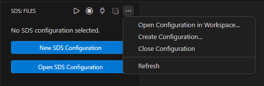
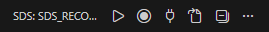
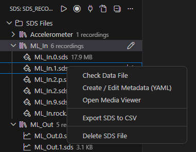
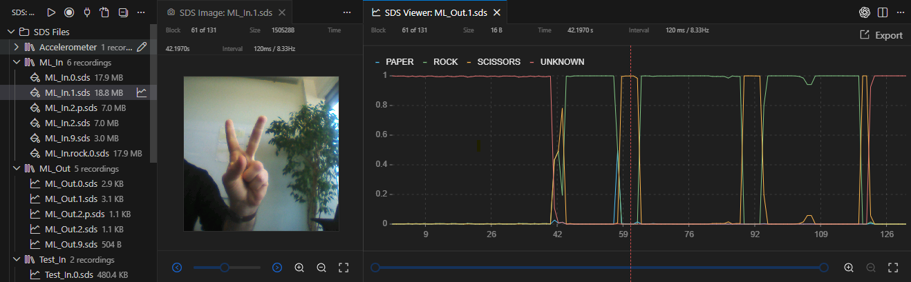
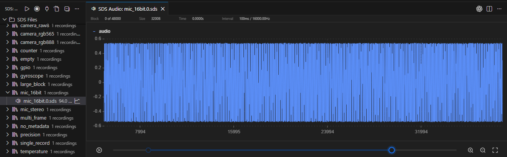
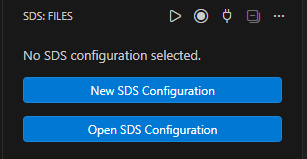
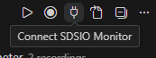
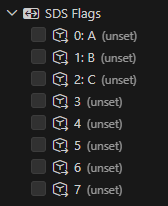

[](https://github.com/Open-CMSIS-Pack/vscode-cmsis-sds/releases)
[](https://github.com/Open-CMSIS-Pack/vscode-cmsis-sds/blob/main/LICENSE)
[](https://github.com/Open-CMSIS-Pack/vscode-cmsis-sds/actions/workflows/ci.yml?query=branch:main)
[](https://github.com/Open-CMSIS-Pack/vscode-cmsis-sds/actions/workflows/markdown.yml?query=branch:main)
[](https://github.com/Open-CMSIS-Pack/vscode-cmsis-sds/actions/workflows/codeql.yml?query=branch:main)
[](https://securityscorecards.dev/viewer/?uri=github.com/Open-CMSIS-Pack/vscode-cmsis-sds)
[](https://github.com/Open-CMSIS-Pack/vscode-cmsis-sds/actions/workflows/dependency-review.yml?query=branch:main)
[](https://qlty.sh/gh/Open-CMSIS-Pack/projects/vscode-cmsis-sds)
[](https://qlty.sh/gh/Open-CMSIS-Pack/projects/vscode-cmsis-sds)

# Arm SDS for VS Code

The Arm SDS extension for VS Code simplifies data capture, inspection, and regression testing with the [SDS-Framework](https://www.keil.arm.com/packs/sds-arm).
The extension provides a VS Code user interface for [SDSIO Server](https://arm-software.github.io/SDS-Framework/main/utilities.html#sdsio-server) and uses an `*.sdsio.yml` control file to define the active SDS workspace.

## SDS Explorer

The **SDS Explorer** shows the active SDS configuration, SDSIO controls, stream labels, SDS groups, metadata files, and recorded SDS data files in one view.
If no configuration is selected, the view offers actions to create or open an `*.sdsio.yml` file.



Toolbar actions:



- **Connect / Disconnect** starts or stops the SDSIO monitor connection.
- **Record** captures new SDS data files from the target.
- **Play** starts playback using the `play:` steps defined in the active `*.sdsio.yml` control file.
- **Stop** stops the current recording or playback session.
- **Open Configuration**, **Create Configuration**, and **Close Configuration** manage the active SDS configuration.

Context menu actions for SDS files include:



- **Check Data File** to run SDS Check on a selected `.sds` file.
- **Create / Edit Metadata (YAML)** to create or open the corresponding `*.sds.yml` metadata file.
- **Open Media Viewer** for image, video, or audio streams.
- **Export SDS to CSV** for decoded sensor data.
- **Open SDS Viewer** for sensor data and line charts.

<br clear="all"/>
When an SDS data file is opened, the corresponding [metadata file](https://arm-software.github.io/SDS-Framework/main/theory.html#yaml-metadata-format) provides stream names, data types, scaling, units, and media information.
The data, audio, image, and video viewers synchronize their cursors so related streams can be inspected together.

Example Video Stream:



Example Audio Stream:



## Usage

### 1. Create or Open an SDS Configuration



Open the SDS sidebar from the Activity Bar.
Click **New SDS Configuration** and enter a name for your project, for example `target-a`.
This creates a `target-a.sdsio.yml` file in your workspace root and selects it as the active SDS configuration.

You can also use **Open SDS Configuration** to open an existing `*.sdsio.yml` file.
If the file is outside the current workspace, the extension opens that folder and remembers the selected configuration.

The file looks like:

```yaml
sdsio:
  interface:
    usb:
  workdir: .
  metadir: .
  flag-info:
    - 0: Flag 0
    - 1: Flag 1
    - 2: Flag 2
    - 3: Flag 3
    - 4: Flag 4
    - 5: Flag 5
    - 6: Flag 6
    - 7: Flag 7
```

### 2. Configure Paths and Flags

Edit your `.sdsio.yml` to set:

- `workdir` - directory where SDS recording files are saved (`.sds` files)
- `metadir` - directory containing metadata files (`.sds.yml` files)
- `flag-info` - custom labels for flags 0-7

Example:

```yaml
workdir: ./recordings
metadir: ./metadata
flag-info:
  - 0: Start
  - 1: Trigger
  - 2: Error
```

The extension provides validation and editor completion for SDS configuration and metadata files, including `*.sdsio.yml`, `*.sds.yml`, and `*.sds.yaml`.

### 3. Connect and Control SDSIO



Click **Connect SDSIO Monitor** in the SDS Explorer toolbar.
If `tools/sdsio-server` is available, the extension launches it with your active `.sdsio.yml` as the control file.
Once connected:

- **Record** - Start recording SDS data from the device
- **Play** - Play back previously recorded data
- **Stop** - Stop the active recording or playback session
- **Flags** - Toggle flags 0-7 to control behavior on the device

Renamed flag labels appear in the SDS Explorer and persist in your `.sdsio.yml`.



### 4. View and Export Your Data

The SDS Explorer groups SDS files by stream name and shows associated metadata where available.
Select a `.sds` file to open it, or use the context menu for more actions.

- Sensor data opens in the SDS Viewer with interactive line charts, zooming, panning, block labels, and CSV export.
- Audio streams open in the Audio Viewer with the same chart cursor and playback controls.
- Image and video streams open in media viewers with frame navigation and file statistics.
- Cursor synchronization keeps data, audio, image, and video views aligned by timestamp.
- **Check Data File** runs SDS Check for a selected `.sds` file.

## Links

- [SDS-Framework](https://arm-software.github.io/SDS-Framework/main/index.html)
- [SDS-YAML Metadata Formoat](https://arm-software.github.io/SDS-Framework/main/theory.html#yaml-metadata-format)
- [SDSIO Control File](https://arm-software.github.io/SDS-Framework/main/utilities.html#sdsio-control-file-sdsioyml)
## License

Apache-2.0
