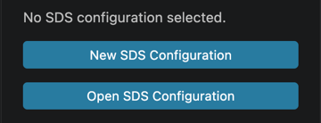
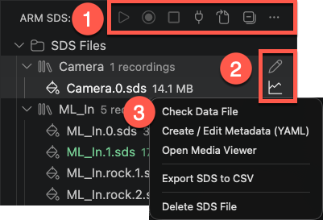
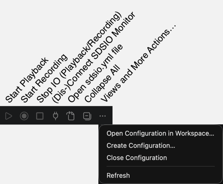
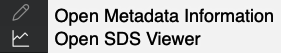
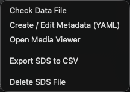
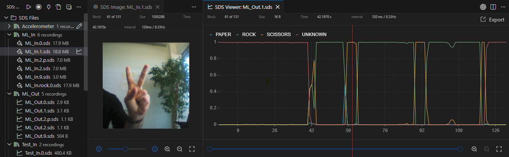
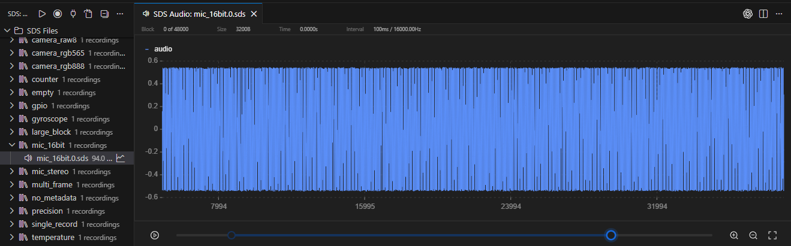
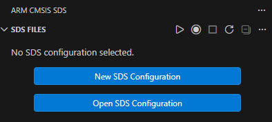
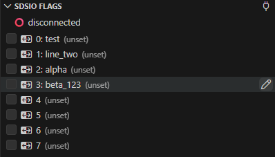

[](https://github.com/Open-CMSIS-Pack/vscode-cmsis-sds/releases)
[](https://github.com/Open-CMSIS-Pack/vscode-cmsis-sds/blob/main/LICENSE)
[](https://github.com/Open-CMSIS-Pack/vscode-cmsis-sds/actions/workflows/ci.yml?query=branch:main)
[](https://github.com/Open-CMSIS-Pack/vscode-cmsis-sds/actions/workflows/markdown.yml?query=branch:main)
[](https://github.com/Open-CMSIS-Pack/vscode-cmsis-sds/actions/workflows/codeql.yml?query=branch:main)
[](https://securityscorecards.dev/viewer/?uri=github.com/Open-CMSIS-Pack/vscode-cmsis-sds)
[](https://github.com/Open-CMSIS-Pack/vscode-cmsis-sds/actions/workflows/dependency-review.yml?query=branch:main)
[](https://qlty.sh/gh/Open-CMSIS-Pack/projects/vscode-cmsis-sds)
[](https://qlty.sh/gh/Open-CMSIS-Pack/projects/vscode-cmsis-sds)

# Arm SDS

The Arm SDS extension for VS Code simplifies data capture, inspection, and regression testing with the
[SDS-Framework](https://www.keil.arm.com/packs/sds-arm). The extension provides a VS Code user interface for an
[SDSIO Server](https://arm-software.github.io/SDS-Framework/main/utilities.html#sdsio-server) and uses an `*.sdsio.yml`
control file to define the active SDS workspace.

This README contains a description of the [SDS View](#sds-view) and explains [how to use](#usage) the extension with the SDS framework.

## SDS View

The **SDS View** shows the active SDS configuration, SDSIO controls, stream labels, SDS groups, metadata files, and
recorded SDS data files in one view.

If no configuration is selected, the view offers actions to create or open an
`*.sdsio.yml` file:



If a configuration is open, the **SDS View** shows the SDS files and related options:



1. The [toolbar](#toolbar-actions) offers different actions.
2. Some files offer dedicated [file action buttons](#file-action-buttons).
3. A [context menu](#context-menu-actions) might be available.

### Toolbar Actions



| Action | Description |
|--------|-------------|
| Play   | Starts playback using the `play:` steps defined in the active `*.sdsio.yml` control file. |
| Record | Captures new SDS data files from the target. |
| Stop | Stops the current recording or playback session. |
| Connect/Disconnect | Starts/stops the SDSIO monitor connection. |
| Open sdsio.yml file | manage the active SDS configuration. |
| Collapse All | Hides all data. |
| Views and More Actions... | Offers **Open Configuration**, **Create Configuration**, and **Close  Configuration** for SDS configuration. |

### File Action Buttons



| Action | Description |
|--------|-------------|
| Open Metadata Information | Open the corresponding *.sds.yml file. |
| Open SDS Viewer | Open file in the SDS Viewer window. |

### Context Menu Actions



| Action | Description |
|--------|-------------|
| Check Data File   | Run SDS Check on a selected `.sds` file. |
| Create / Edit Metadata (YAML) | Create or open the corresponding `*.sds.yml` metadata file. |
| Open Media Viewer | View image, video, or audio streams. |
| Export SDS to CSV | Export functions for decoded sensor data. |
| Open SDS Viewer   | View sensor data and line charts. |

When an SDS data file is opened, the corresponding
[metadata file](https://arm-software.github.io/SDS-Framework/main/theory.html#yaml-metadata-format) provides stream
names, data types, scaling, units, and media information. The data, audio, image, and video viewers synchronize their
cursors so related streams can be inspected together.

### Video Stream Examples



### Audio Stream Example



## Usage

### Create or Open an SDS Configuration



1. Open the [SDS View](#sds-view) from the Activity Bar.
2. Click **New SDS Configuration** and enter a name for your project, for example `target-a`.
3. This creates a `target-a.sdsio.yml` file in your workspace root and selects it as the active SDS configuration.

Alternatively, you can use **Open SDS Configuration** to open an existing `*.sdsio.yml` file. If the file is outside
the current workspace, the extension opens that folder and remembers the selected configuration.

**Example**

```yaml
sdsio:
  interface:
    usb:
  workdir: .
  metadir: .
  flag-info:
    - 0: Flag 0
    - 1: Flag 1
    - 2: Flag 2
    - 3: Flag 3
    - 4: Flag 4
    - 5: Flag 5
    - 6: Flag 6
    - 7: Flag 7
```

Edit your `.sdsio.yml` to set:

| Property    | Description |
|-------------|-------------|
| `workdir`   | Directory where SDS recording files are saved (`.sds` files) |
| `metadir`   | Directory containing metadata files (`.sds.yml` files) |
| `flag-info` | Custom labels for flags 0-7 |

**Example**

```yaml
workdir: ./recordings
metadir: ./metadata
flag-info:
  - 0: Start
  - 1: Trigger
  - 2: Error
```

The extension provides validation and editor completion for SDS configuration and metadata files, including
`*.sdsio.yml`, `*.sds.yml`, and `*.sds.yaml`.

### Connect and Control SDSIO

To connect to an SDSIO server running on your target, click **Connect SDSIO Monitor** in the
[SDS View toolbar](#toolbar-actions). If an SDSIO server is available, the extension launches it with your active
`.sdsio.yml` as the control file.

Once connected, you can play back previously recorded data, record new data from the device, and toggle flags to control the behavior of the devide.

Renamed flag labels appear in the SDS Explorer and persist in your `.sdsio.yml`.



### View and Export Your Data

The SDS View groups SDS files by stream name and shows associated metadata where available. Select a `.sds` file to
open it, or use the context menu for more actions.

- Sensor data opens in the SDS Viewer with interactive line charts, zooming, panning, block labels, and CSV export.
- Audio streams open in the Audio Viewer with the same chart cursor and playback controls.
- Image and video streams open in media viewers with frame navigation and file statistics.
- Cursor synchronization keeps data, audio, image, and video views aligned by timestamp.
- **Check Data File** runs SDS Check for a selected `.sds` file.

## Links

- [SDS-Framework](https://arm-software.github.io/SDS-Framework/main/index.html)
- [SDS-YAML Metadata Formoat](https://arm-software.github.io/SDS-Framework/main/theory.html#yaml-metadata-format)
- [SDSIO Control File](https://arm-software.github.io/SDS-Framework/main/utilities.html#sdsio-control-file-sdsioyml)
